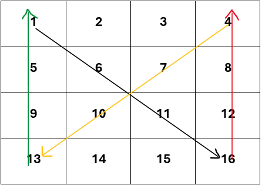

# SAVE PLANET 'EXIS' to restore POWER💡 by solving the puzzle 

## Story behind saving the planet EXIS 🚀
Blast off on the BIGGEST micro-adventure..It's out of this world 🌍into SPACE!! It's a mission to save Planet EXIS(Nok's home planet),which is running out of power. Hope 'YOU' and micro-friends(Nok and Seven,a robot) will be able to reach Planet Exis to collect FOUR fragments that have been hidden/encoded.Together the fragments form the core of Exis.Only core will restore the power to the planet 'EXIS'.

### Solve the puzzle to get the FOUR fragments🧩

Follow the instructions below to solve the puzzle and get the four fragments.

Given an n x n array with positive integer values,like below 4X4 array as an example: 
array = [
         [1,2,3,4],
         [5,6,7,8],
         [9,10,11,12],
         [13,14,15,16]
        ]

🌟Note: Open the file in preview mode to have a look at the image below

   

### 🎫 Ticket 1:        
Traverse along the array diagonally in the 'BLACK LINE' pattern shown in the above image starting at first element and get the sum of all items in the traverse and store it as first element in array variable 'Result'. 
   
    After Step 1 on the above example :
      Result = [34]; (1+6+11+16);

### 🎫 Ticket 2:
Traverse along the array in the 'RED LINE' pattern shown in the above image and get the sum of all items in the traverse and store it in array variable 'Result'.

    After Step 2 on the above example :
      Result = [34,40]; 

### 🎫 Ticket 3:
Traverse along the array in the 'YELLOW LINE' pattern shown in the above image and get the sum of all items in the traverse and store it in array variable 'Result'.
    
    After Step 3 on the above example :
      Result = [34,40,34];

### 🎫 Ticket 4:
Traverse along the array in the 'GREEN LINE' pattern shown in the above image and get the sum of all items in the traverse and store it in array variable 'Result'.
    
    After Step 3 on the above example :
      Result = [34,40,34,28];

🌟NOTE :
  Information : ASCII (American Standard Code for Information Interchange) values are numeric representations of characters used in computers and digital devices. In the ASCII character encoding scheme, each character is assigned a unique number ranging from 0 to 126.

### 🎫 Ticket 5: 
Result array elements are ASCII values and need to get characters representation of each element, which are four fragments to unlock the core.

🌟Important clue: As EXIS is NOk's home planet, he had a clue that ASCII values below 33 and above 126 are not valid numbers to obtain fragments and hence such numbers need to be replaced with ASCII value 48.

### 🎫 Ticket 6: 
Find Character representation for ASCII values of the 'Result array' after using the clue to get the FOUR fragments details to save core of planet 'EXIS' to help restore power.

Hope You will find the fragments and will save the planet EXIS.🤝

Happy Coding 😎🎉

